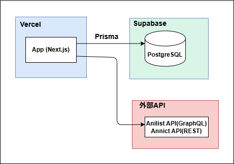
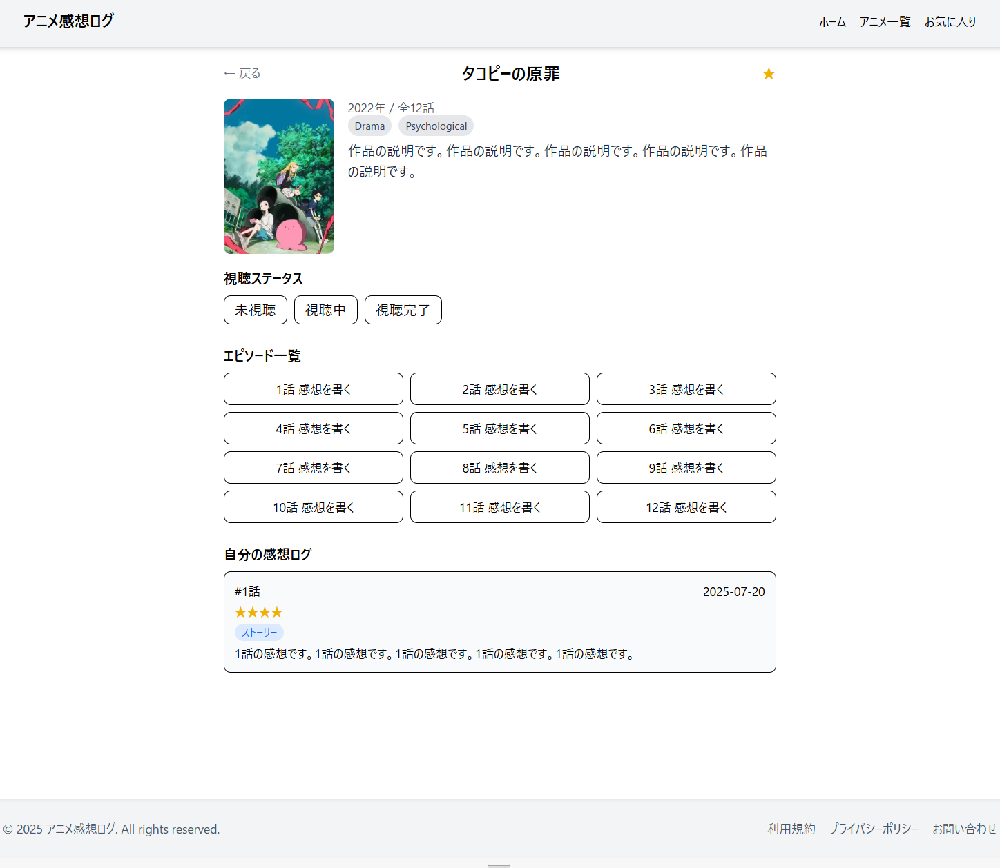
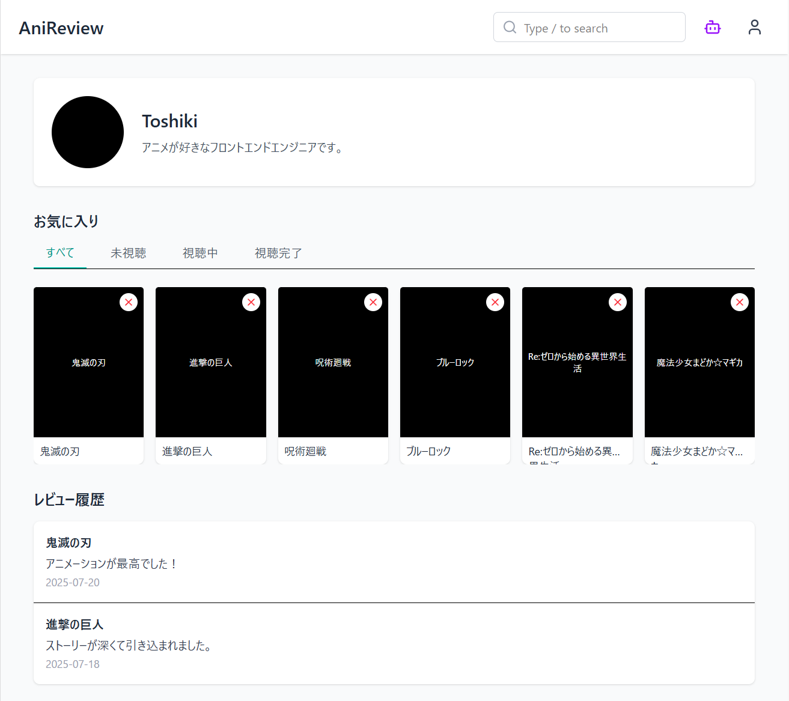

## Anime Review Log（アニメ感想ログ）

アニメの感想や評価を自分のために記録できる、**シンプルなレビューアプリ**です。
作品ごと、エピソードごとに感想を管理できます。

---

## 制作意図

現在は多くのサブスクリプションサービスが存在し、何を観たのか、どう感じたのかを自分のために整理・記録できる機能が欲しいと考えました。
また、私自身がアニメ制作会社やアニメーターに関心を持っているため、そうした切り口から作品を探せるよう、フィルター機能なども取り入れる工夫をしています。

---

### 構成図



---

### 画面イメージ

#### ホーム


#### 作品詳細



#### マイページ

## 

## 機能一覧

- 作品の検索（Anilist API を使用）
- 作品・エピソードの一覧表示
- 各アニメ・エピソードに対してレビュー投稿・閲覧
- お気に入り管理機能（予定）

---

## 技術スタック

| 項目           | 使用技術                                              | 採用理由（詳細）                                                                                                                                                         |
| -------------- | ----------------------------------------------------- | ------------------------------------------------------------------------------------------------------------------------------------------------------------------------ |
| フレームワーク | **Next.js 15（App Router）**                          | React ベースで扱いやすく、App Router によりページ構成が明確。SSR/CSR の柔軟な切り替えが可能で、将来的な画面追加にも強い構成。Next.js の学習も兼ねて導入。                |
| スタイル       | **Tailwind CSS**                                      | Chakra UI から移行。Tailwind はカスタマイズ性が高く、ユーティリティファーストでのスタイル設計により、柔軟なレイアウト調整と開発効率の向上が実現できた。                  |
| API 連携       | **Anilist API（GraphQL）**<br/>**Annict API（REST）** | Anilist は GraphQL 対応で柔軟なクエリが可能。Annict は日本向けデータが豊富。どちらか一方では補えない情報があるため、2 つを補完的に利用して実用性を高めている。           |
| ユーザー認証   | **NextAuth.js（Credentials Provider）**               | サーバーサイドでセッション管理を簡単に実装可能。Supabase 認証との連携も視野に、今後 OAuth 対応も見据えて Credentials Provider を使用。ログイン機能の導入が容易。         |
| デプロイ環境   | **Vercel**                                            | Next.js に最適化されており、設定不要で高速にデプロイ可能。無料枠でもサーバーレス運用に対応でき、個人開発でも実用的。                                                     |
| データベース   | **Supabase（PostgreSQL）**                            | 認証・DB・ストレージが統合された BaaS。個人〜中小規模のアプリに最適。リアルタイム対応や拡張性も高く、PostgreSQL ベースなので Prisma との相性も良い。                     |
| ORM            | **Prisma**                                            | 型安全で補完が効き、クエリ構築も直感的。マイグレーション管理も可能で、開発体験・保守性の両方を大きく向上させる。Supabase（PostgreSQL）との組み合わせで最大限に活用可能。 |

---

## ディレクトリ構成（抜粋）

```txt
.
├── app/
│   ├── anime/            # アニメ一覧ページ
│   ├── layout.tsx        # ルートレイアウト
│   ├── page.tsx          # ホーム画面
│
├── components/
│   ├── Header.tsx        # ヘッダー
│   ├── Footer.tsx        # フッター
│   ├── AnimeGrid.tsx     # アニメ一覧グリッド
│   ├── AnimeCard.tsx     # 各アニメカード
│   ├── SearchBar.tsx     # タイトル検索バー
│
├── styles/
│   └── globals.css       # グローバルスタイル（Tailwindベース）
```

---

## 外部 API について

このアプリでは、以下の API からアニメ情報を取得しています：

- [Anilist GraphQL API](https://anilist.gitbook.io/anilist-apiv2-docs/)

---

## 今後の予定（ToDo）

- [ ]

---
