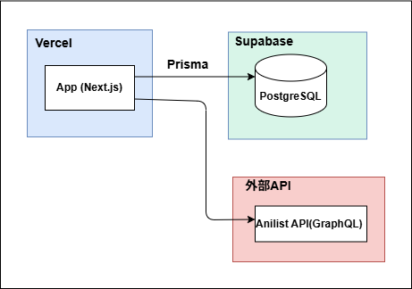
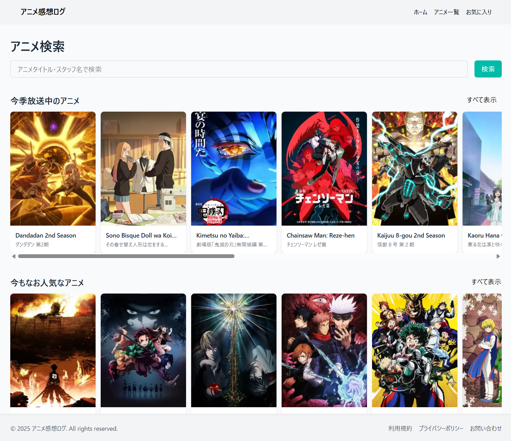
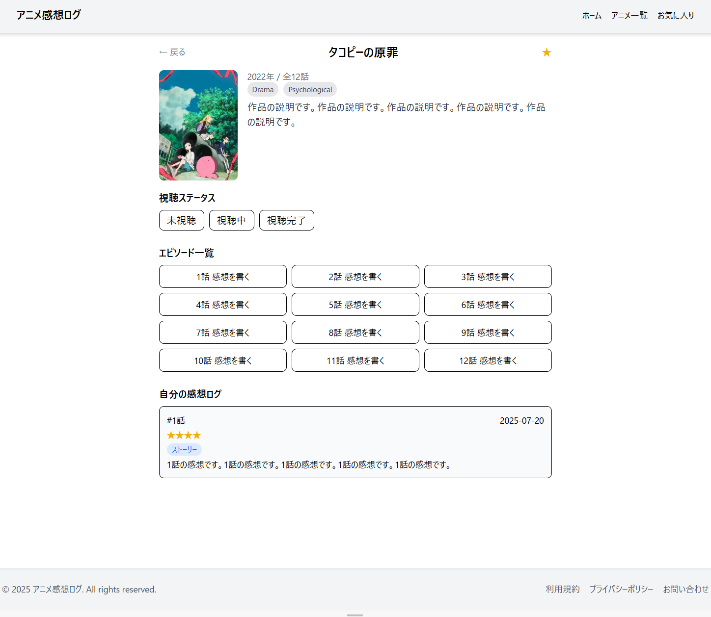
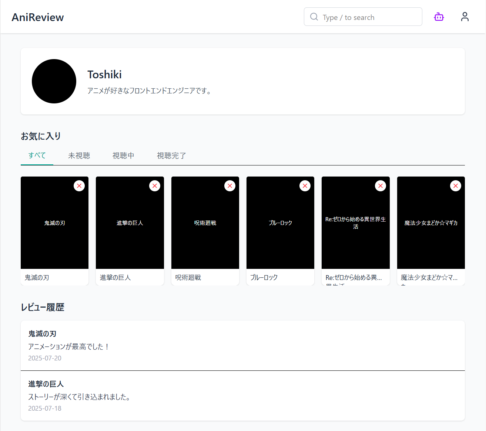
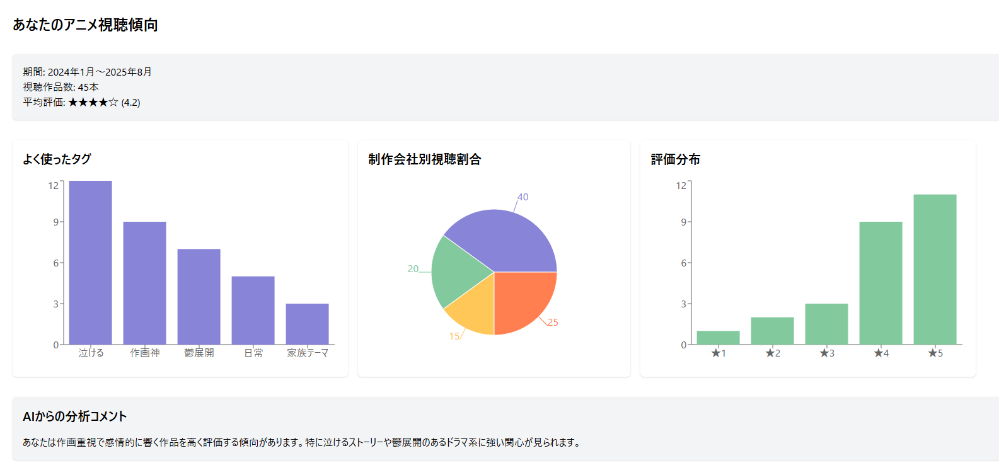

# 🎥 Anime Review Log（アニメ感想ログ）

アニメの感想や評価を**自分のために**記録できる、シンプルで静かな雰囲気のレビューアプリです。  
作品ごと・エピソードごとに感想をまとめ、振り返りや整理に役立ちます。

---

## 🎯 制作意図

- サブスク時代において「何を観たか」「どう感じたか」を自分自身で記録したい。
- アニメ制作会社やアニメーターへの関心から、「制作会社」「スタッフ」などでも検索・フィルタできるように。
- フィルターや分析機能を使って、自分なりの視点でアニメ体験を深められるよう設計。

---

## 🧠 追加機能：OpenAI × 自然言語検索（AI 検索）

> 「最近の感動するアニメってなにかある？」  
> 「ゆったりした雰囲気のアニメを探したい」  
> といった自然な言葉で検索できる AI 機能を搭載。

- OpenAI API（GPT-4o）を利用し、入力された自然言語を **Anilist API 用 GraphQL クエリ** に変換
- **ユーザーの曖昧な希望や雰囲気** をもとに作品を検索・提案
- 検索結果には画像・ジャンル・説明付きで表示

---

## 🧩 システム構成図



---

## 🖼️ 画面イメージ

| ホーム                                                        | 作品詳細                                          |
| ------------------------------------------------------------- | ------------------------------------------------- |
|  |  |

| マイページ                                                    | 分析画面                                                      |
| ------------------------------------------------------------- | ------------------------------------------------------------- |
|  |  |

---

## 🔧 主な機能

- Anilist API を使ったアニメ作品の検索・取得
- 各作品・エピソードに対する感想・評価・タグの記録
- お気に入り登録（予定）
- 制作会社・アニメーターによるフィルター
- 自然言語による検索（OpenAI API）

---

## ⚙️ 技術スタック

| 項目           | 使用技術                                             | 採用理由                                                                                                 |
| -------------- | ---------------------------------------------------- | -------------------------------------------------------------------------------------------------------- |
| フレームワーク | **Next.js 15（App Router）**                         | SSR/CSR 切り替えが柔軟。App Router により構造が明確で、将来の画面追加にも強い。学習目的も兼ねて採用。    |
| スタイル       | **Tailwind CSS**                                     | ユーティリティファーストで柔軟なレイアウト調整が可能。Chakra UI から移行し、より自由度の高い実装に。     |
| API 連携       | **Anilist API（GraphQL）**<br>**Annict API（REST）** | Anilist は GraphQL による柔軟なデータ取得、Annict は日本特化のデータをカバー。両方の長所を活かして統合。 |
| AI 検索        | **OpenAI API（GPT-4o）**                             | 自然言語からアニメ検索を可能に。キーワード不要のフレキシブルな検索体験を実現。                           |
| 認証           | **NextAuth.js（Credentials Provider）**              | ローカル開発でも扱いやすい。将来的に OAuth にも拡張可能。                                                |
| データベース   | **Supabase（PostgreSQL）**                           | 認証・DB・ストレージを一元管理。リアルタイム対応・型安全もあり Prisma と相性良好。                       |
| ORM            | **Prisma**                                           | 補完が強力で型安全。マイグレーション管理に強く、保守性・拡張性に優れる。                                 |
| デプロイ       | **Vercel**                                           | Next.js に最適化されており、高速なデプロイと無料枠による運用が可能。                                     |

---

## 📁 ディレクトリ構成（抜粋）

```txt
.
├── app/
│   ├── anime/            # アニメ一覧ページ
│   ├── layout.tsx        # ルートレイアウト
│   ├── page.tsx          # ホーム画面
│
├── components/
│   ├── Header.tsx
│   ├── Footer.tsx
│   ├── AnimeGrid.tsx
│   ├── AnimeCard.tsx
│   ├── SearchBar.tsx
│   ├── AiSearchModal.tsx     # 自然言語検索用のモーダル
│
├── lib/
│   ├── openai.ts             # OpenAI との通信ロジック
│   ├── anilist.ts            # Anilist GraphQL クエリ作成ユーティリティ
```
