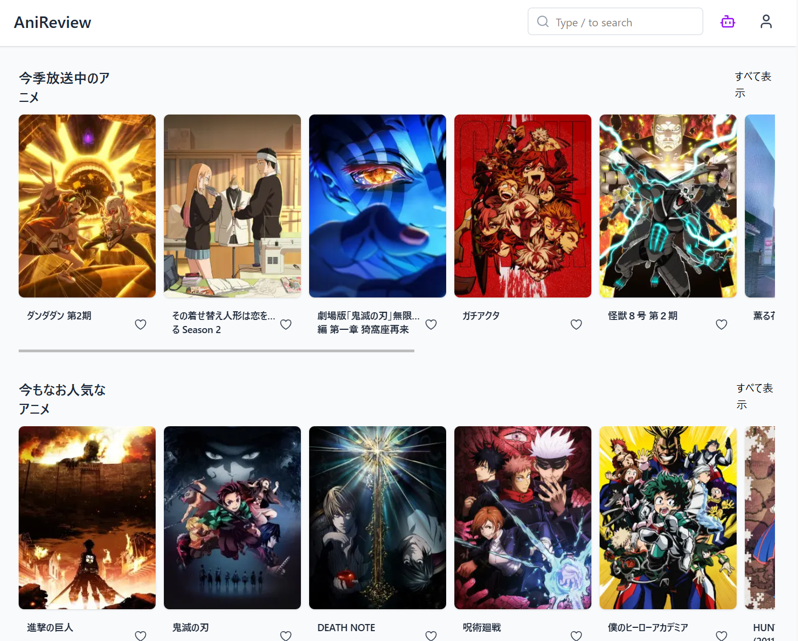

## Anime Review Log（アニメ感想ログ）

アニメの感想や評価を自分のために記録できる、**シンプルなレビューアプリ**です。
作品ごと、エピソードごとに感想を管理できます。

---

### 画面イメージ

<!--  -->

---

## 機能一覧

- 作品の検索（Anilist API を使用）
- 作品・エピソードの一覧表示
- 各アニメ・エピソードに対してレビュー投稿・閲覧
- お気に入り管理機能（予定）

---

## 技術スタック

| 項目           | 使用技術                                      | 採用理由                                                                 |
| -------------- | --------------------------------------------- | ------------------------------------------------------------------------ |
| フレームワーク | Next.js 15（App Router）                      | サーバー/クライアント統合で柔軟に構築可能、App Router で最新構成に対応   |
| スタイル       | Tailwind CSS                                  | ユーティリティファーストでスタイルの一貫性と開発効率を両立               |
| API 連携       | Anilist API（GraphQL）<br/>Annict API（REST） | 豊富なアニメ・エピソード情報を外部から取得でき、実運用に即した構成が可能 |
| ユーザー認証   | NextAuth.js（Credentials Provider 使用）      | サーバーサイドでのセッション管理が簡単に行え、認証機能を早期実装可能     |
| デプロイ環境   | Vercel                                        | Next.js と親和性が高く、サーバーレスでの運用が容易かつ無料枠でも十分     |
| データベース   | Supabase（PostgreSQL）                        | 認証・DB・ストレージが一体化されており、個人〜中規模まで対応可能         |
| ORM            | Prisma                                        | 型安全・マイグレーション・複雑なクエリ構築に強く、保守性と開発効率が高い |

Nextjs
　フロントエンド側のフレームワークは普段から触れている React をベースに考えました。
　今回の規模であれば、素の React で SPA で組んでもよかったのですが、nextjs の学習のため、ルーティングのわかりやすさ
　今後の画面数が多くなることを想定して採用しました

tailwindcss
　 chakuraui といった css コンポーネントライブラリをレイアウトのきれいさ、開発スピードをみて導入しておりましたが、
開発をしていくうちにカスタマイズのしにくさ、ほしいプロパティが存在しないなど逆に開発効率が落ちてしまいました
そこで柔軟に css を指定できたりする tailwindcss を採用しました

アニメ・エピソード情報が豊富でドキュメントも見やすいことから採用。いずれも欲しい情報がなかったりあったり、するため
それぞれ補完しあう形で２つ外部ＡＰＩを導入しております

---

## ディレクトリ構成（抜粋）

```txt
.
├── app/
│   ├── anime/            # アニメ一覧ページ
│   ├── layout.tsx        # ルートレイアウト
│   ├── page.tsx          # ホーム画面
│
├── components/
│   ├── Header.tsx        # ヘッダー
│   ├── Footer.tsx        # フッター
│   ├── AnimeGrid.tsx     # アニメ一覧グリッド
│   ├── AnimeCard.tsx     # 各アニメカード
│   ├── SearchBar.tsx     # タイトル検索バー
│
├── styles/
│   └── globals.css       # グローバルスタイル（Tailwindベース）
```

---

## セットアップ方法

1. **リポジトリをクローン**

   ```bash
   git clone https://github.com/Toshiki2968/ani-review.git
   cd anime-review-log
   ```

2. **依存関係をインストール**

   ```bash
   npm install
   ```

3. **開発サーバを起動**

   ```bash
   npm run dev
   ```

4. **ブラウザでアクセス**

   ```
   http://localhost:3000
   ```

---

## 外部 API について

このアプリでは、以下の API からアニメ情報を取得しています：

- [Anilist GraphQL API](https://anilist.gitbook.io/anilist-apiv2-docs/)

- [Annnict REST API](https://developers.annict.com/docs/rest-api/v1)

---

## 今後の予定（ToDo）

- [ ] アニメに対するエピソードの自動取得・表示
- [ ] ユーザーによるレビュー投稿・編集機能
- [ ] フィルタリング
- [ ] AI 検索：気分やジャンルからアニメ提案
- [ ] お気に入り管理

---

## 制作意図

現在は多くのサブスクリプションサービスが存在し、何を観たのか、どう感じたのかを自分のために整理・記録できる機能が欲しいと考えました。
また、私自身がアニメ制作会社やアニメーターに関心を持っているため、そうした切り口から作品を探せるよう、フィルター機能なども取り入れる工夫をしています。
