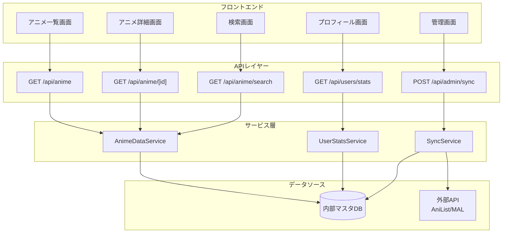

```mermaid
graph TB
    subgraph "フロントエンド"
        A[アニメ一覧画面]
        B[アニメ詳細画面]
        C[検索画面]
        D[プロフィール画面]
        E[管理画面]
    end

    subgraph "APIレイヤー"
        F[GET /api/anime]
        G["GET /api/anime/[id]"]
        H[GET /api/anime/search]
        I[POST /api/admin/sync]
        J[GET /api/users/stats]
    end

    subgraph "サービス層"
        K[AnimeDataService]
        L[UserStatsService]
        M[SyncService]
    end

    subgraph "データソース"
        N[(内部マスタDB)]
        O[外部API<br/>AniList/MAL]
    end

    A --> F
    B --> G
    C --> H
    D --> J
    E --> I

    F --> K
    G --> K
    H --> K
    I --> M
    J --> L

    K --> N
    L --> N
    M --> O
    M --> N
```
