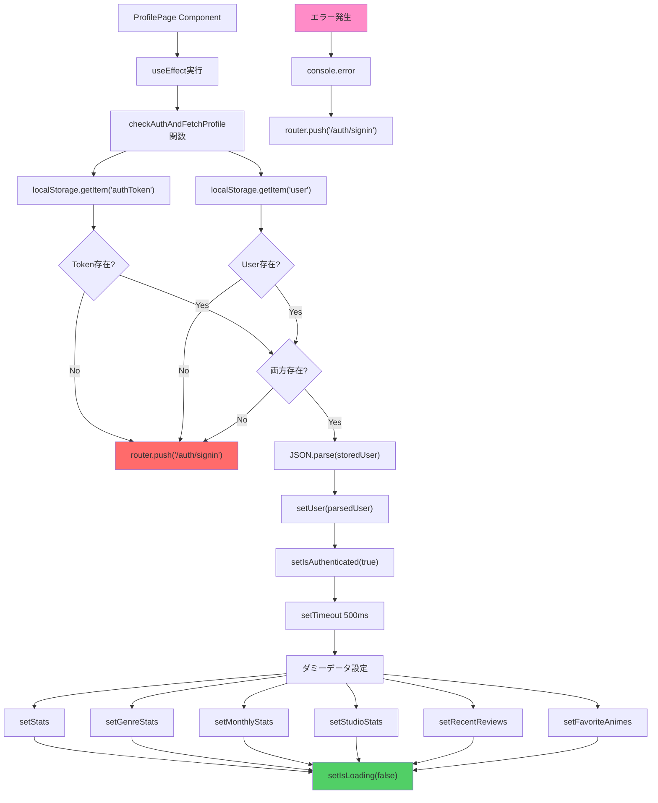
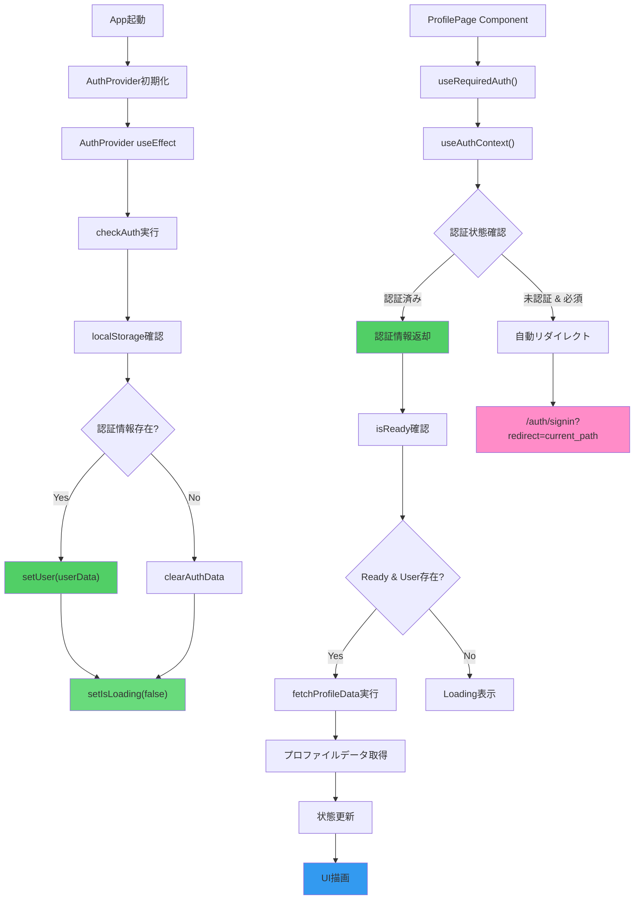
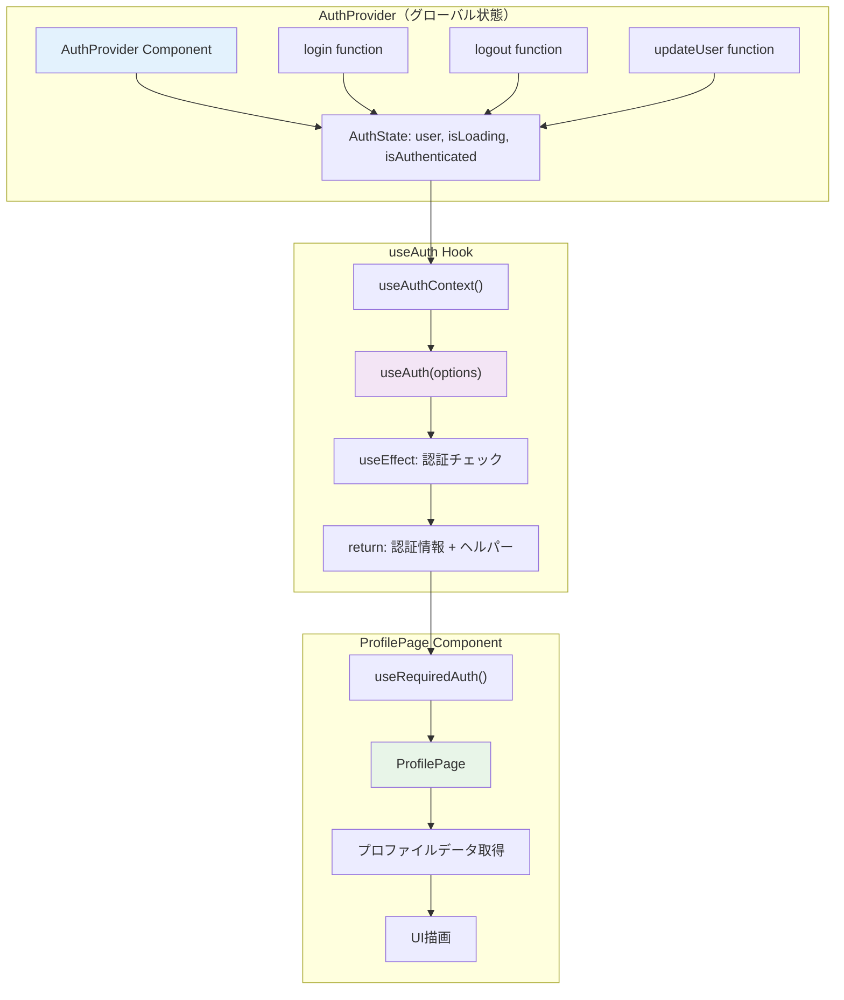
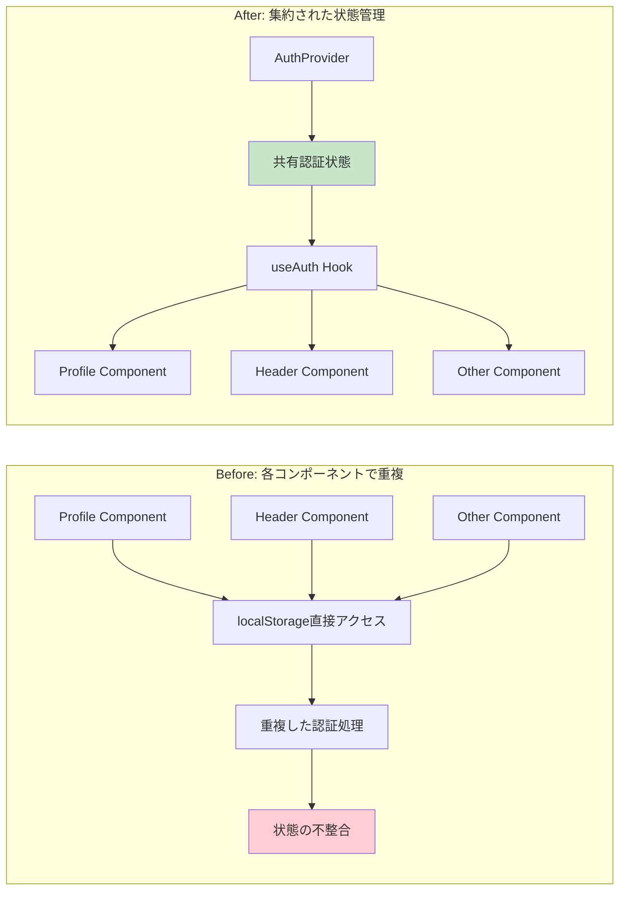
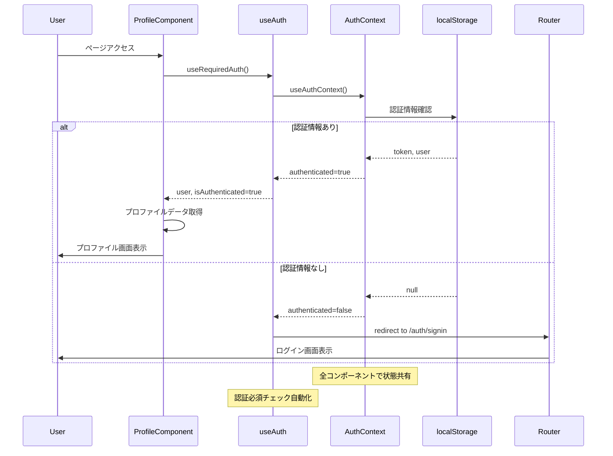
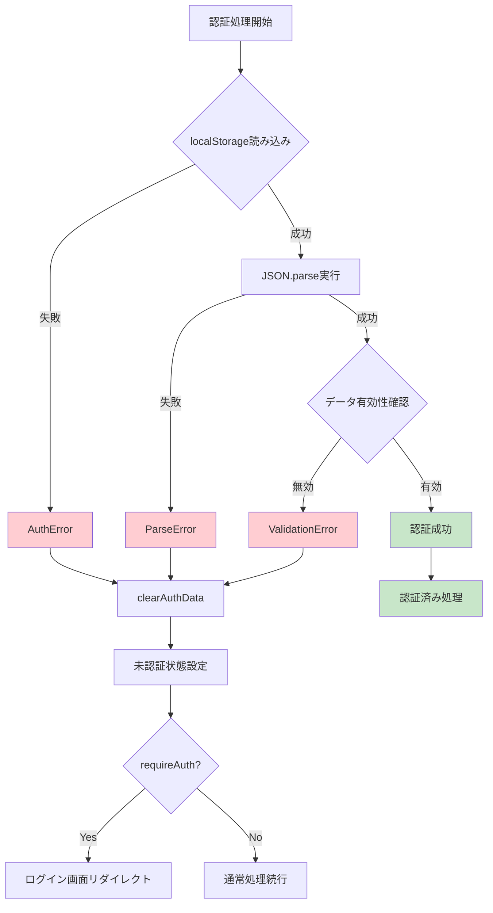
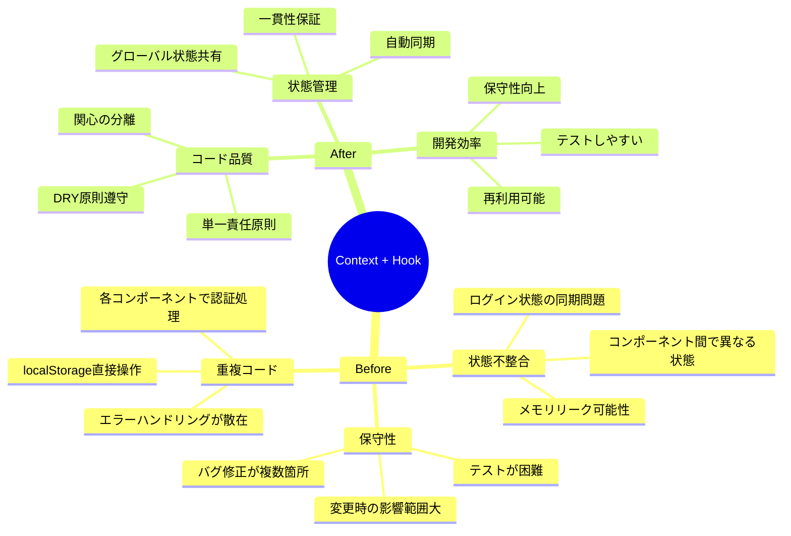

# プロファイルページの処理フロー

## 現在の実装（Before - 複雑な処理）

```mermaid
flowchart TD
    A[ProfilePage Component] --> B[useEffect実行]
    B --> C[checkAuthAndFetchProfile関数]
    C --> D["localStorage.getItem('authToken')"]
    C --> E["localStorage.getItem('user')"]

    D --> F{Token存在?}
    E --> G{User存在?}

    F -->|No| H["router.push('/auth/signin')"]
    G -->|No| H
    F -->|Yes| I{両方存在?}
    G -->|Yes| I

    I -->|No| H
    I -->|Yes| J["JSON.parse(storedUser)"]
    J --> K["setUser(parsedUser)"]
    K --> L["setIsAuthenticated(true)"]

    L --> M[setTimeout 500ms]
    M --> N[ダミーデータ設定]
    N --> O[setStats]
    N --> P[setGenreStats]
    N --> Q[setMonthlyStats]
    N --> R[setStudioStats]
    N --> S[setRecentReviews]
    N --> T[setFavoriteAnimes]

    O --> U["setIsLoading(false)"]
    P --> U
    Q --> U
    R --> U
    S --> U
    T --> U

    V[エラー発生] --> W[console.error]
    W --> X["router.push('/auth/signin')"]

    style H fill:#ff6b6b
    style U fill:#51cf66
    style V fill:#ff8cc8
```

## 改善後の実装（After - Context + カスタムフック）

```mermaid
flowchart TD
    A[App起動] --> B[AuthProvider初期化]
    B --> C[AuthProvider useEffect]
    C --> D[checkAuth実行]
    D --> E[localStorage確認]
    E --> F{認証情報存在?}
    F -->|Yes| G["setUser(userData)"]
    F -->|No| H[clearAuthData]
    G --> I["setIsLoading(false)"]
    H --> I

    J[ProfilePage Component] --> K["useRequiredAuth()"]
    K --> L["useAuthContext()"]
    L --> M{認証状態確認}
    M -->|未認証 & 必須| N[自動リダイレクト]
    M -->|認証済み| O[認証情報返却]

    O --> P[isReady確認]
    P --> Q{Ready & User存在?}
    Q -->|Yes| R[fetchProfileData実行]
    Q -->|No| S[Loading表示]

    R --> T[プロファイルデータ取得]
    T --> U[状態更新]
    U --> V[UI描画]

    N --> W["/auth/signin?redirect=current_path"]

    style G fill:#51cf66
    style I fill:#69db7c
    style O fill:#51cf66
    style V fill:#339af0
    style W fill:#ff8cc8
```

## Context + カスタムフックの詳細構造

```mermaid
graph TB
    subgraph "AuthProvider（グローバル状態）"
        AP[AuthProvider Component]
        AS[AuthState: user, isLoading, isAuthenticated]
        AL[login function]
        AO[logout function]
        AU[updateUser function]
    end

    subgraph "useAuth Hook"
        UA["useAuth(options)"]
        UC["useAuthContext()"]
        UE[useEffect: 認証チェック]
        UR[return: 認証情報 + ヘルパー]
    end

    subgraph "ProfilePage Component"
        PC[ProfilePage]
        URA["useRequiredAuth()"]
        PD[プロファイルデータ取得]
        UI[UI描画]
    end

    AP --> AS
    AS --> UC
    UC --> UA
    UA --> UE
    UE --> UR
    UR --> URA
    URA --> PC
    PC --> PD
    PD --> UI

    AL --> AS
    AO --> AS
    AU --> AS

    style AP fill:#e3f2fd
    style UA fill:#f3e5f5
    style PC fill:#e8f5e8
```

## データフローの比較

```mermaid
graph LR
    subgraph "Before: 各コンポーネントで重複"
        B1[Profile Component]
        B2[Header Component]
        B3[Other Component]
        B4[localStorage直接アクセス]
        B5[重複した認証処理]
        B6[状態の不整合]

        B1 --> B4
        B2 --> B4
        B3 --> B4
        B4 --> B5
        B5 --> B6
    end

    subgraph "After: 集約された状態管理"
        A1[AuthProvider]
        A2[共有認証状態]
        A3[Profile Component]
        A4[Header Component]
        A5[Other Component]
        A6[useAuth Hook]

        A1 --> A2
        A2 --> A6
        A6 --> A3
        A6 --> A4
        A6 --> A5
    end

    style B6 fill:#ffcdd2
    style A2 fill:#c8e6c9
```

## 認証フローの詳細

```mermaid
sequenceDiagram
    participant U as User
    participant PC as ProfileComponent
    participant UA as useAuth
    participant AC as AuthContext
    participant LS as localStorage
    participant R as Router

    U->>PC: ページアクセス
    PC->>UA: useRequiredAuth()
    UA->>AC: useAuthContext()
    AC->>LS: 認証情報確認

    alt 認証情報あり
        LS-->>AC: token, user
        AC-->>UA: authenticated=true
        UA-->>PC: user, isAuthenticated=true
        PC->>PC: プロファイルデータ取得
        PC->>U: プロファイル画面表示
    else 認証情報なし
        LS-->>AC: null
        AC-->>UA: authenticated=false
        UA->>R: redirect to /auth/signin
        R->>U: ログイン画面表示
    end

    Note over AC: 全コンポーネントで状態共有
    Note over UA: 認証必須チェック自動化
```

## エラーハンドリングの改善

```mermaid
flowchart TD
    A[認証処理開始] --> B{localStorage読み込み}
    B -->|成功| C[JSON.parse実行]
    B -->|失敗| D[AuthError]

    C -->|成功| E{データ有効性確認}
    C -->|失敗| F[ParseError]

    E -->|有効| G[認証成功]
    E -->|無効| H[ValidationError]

    D --> I[clearAuthData]
    F --> I
    H --> I

    I --> J[未認証状態設定]
    J --> K{requireAuth?}
    K -->|Yes| L[ログイン画面リダイレクト]
    K -->|No| M[通常処理続行]

    G --> N[認証済み処理]

    style D fill:#ffcdd2
    style F fill:#ffcdd2
    style H fill:#ffcdd2
    style G fill:#c8e6c9
    style N fill:#c8e6c9
```

## 状態管理の改善効果

```mermaid
mindmap
  root((Context + Hook))
    Before
      重複コード
        各コンポーネントで認証処理
        localStorage直接操作
        エラーハンドリングが散在
      状態不整合
        コンポーネント間で異なる状態
        ログイン状態の同期問題
        メモリリーク可能性
      保守性
        変更時の影響範囲大
        テストが困難
        バグ修正が複数箇所
    After
      コード品質
        DRY原則遵守
        単一責任原則
        関心の分離
      状態管理
        グローバル状態共有
        一貫性保証
        自動同期
      開発効率
        再利用可能
        テストしやすい
        保守性向上
```
